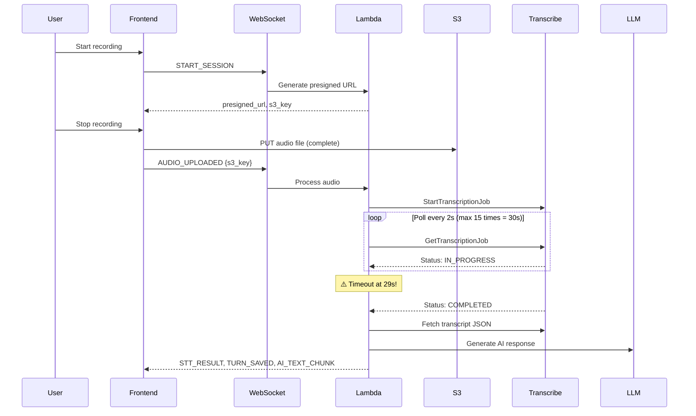
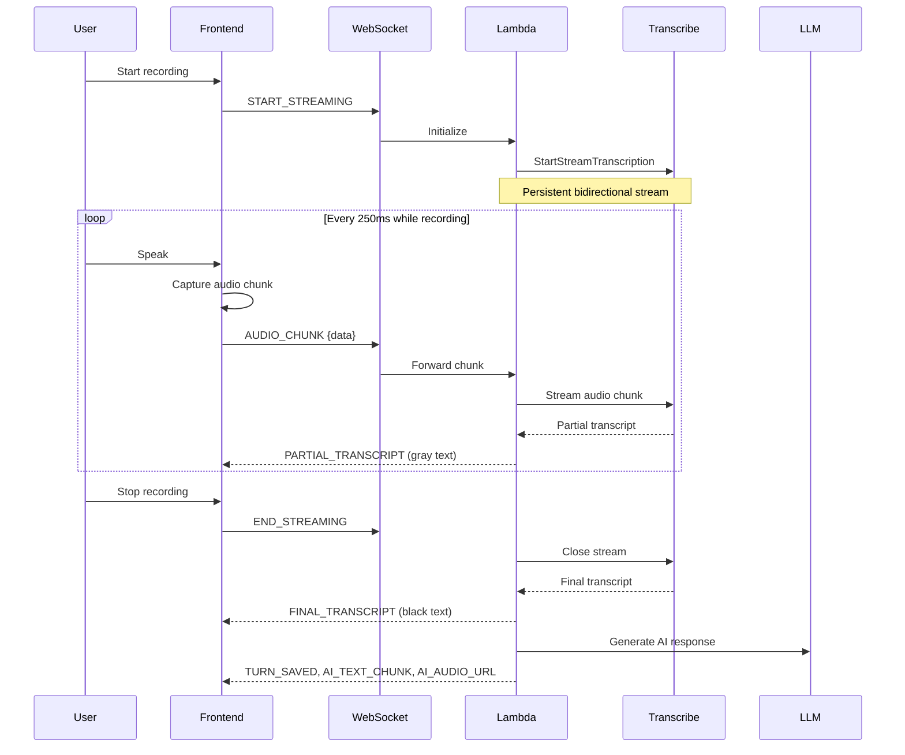

# Design Document: Streaming Transcription

## Overview

This design migrates the speaking practice pipeline from batch Amazon Transcribe (with 30-second polling timeouts) to streaming Amazon Transcribe for real-time audio transcription. The current implementation uploads complete audio files to S3, then polls batch Transcribe jobs which timeout while Lambda has a 29-second limit. The new implementation streams audio chunks in real-time via WebSocket, eliminating polling and providing immediate partial transcripts as the user speaks.

### Key Benefits

- **Real-time feedback**: Users see transcription as they speak (like Google Meet captions)
- **No polling timeouts**: Streaming eliminates the batch job polling pattern
- **Faster pipeline**: Transcription starts immediately, not after upload completes
- **Better UX**: Partial transcripts provide immediate visual feedback

### Constraints

- AWS SDK for Python (Boto3) does NOT support Transcribe Streaming
- Must use `amazon-transcribe-streaming-sdk` (async Python SDK)
- Lambda timeout remains 29 seconds (WebSocket connection limit)
- Audio format must be PCM or Opus (16kHz, mono)

## Architecture

### Current Architecture (Batch Transcribe)



**Problems:**
- Polling loop can timeout (30s max, Lambda 29s limit)
- No feedback until recording completes
- S3 upload adds latency
- Batch job overhead (job creation, polling, cleanup)


### New Architecture (Streaming Transcribe)



**Improvements:**
- No polling - streaming is bidirectional
- Real-time partial transcripts (immediate feedback)
- No S3 upload for transcription (faster)
- No timeout risk (streaming completes when user stops)

## Components and Interfaces

### Frontend Components

#### 1. Audio Recorder (`use-audio-recorder.ts`)

**Current Implementation:**
```typescript
// Records complete audio, then uploads to S3
const recorder = new MediaRecorder(stream, { mimeType: "audio/webm;codecs=opus" });
recorder.ondataavailable = (ev) => chunks.push(ev.data);
recorder.onstop = async () => {
  const blob = new Blob(chunks, { type: "audio/webm" });
  await uploadToS3(presignedUrl, blob);
  onRecordingComplete(s3Key);
};
```

**New Implementation:**
```typescript
// Streams audio chunks in real-time
const recorder = new MediaRecorder(stream, {
  mimeType: "audio/webm;codecs=opus",
  audioBitsPerSecond: 16000
});

recorder.ondataavailable = (ev: BlobEvent) => {
  if (ev.data.size > 0) {
    // Send chunk immediately via WebSocket
    sendAudioChunk(ev.data);
  }
};

// Start with 250ms chunks
recorder.start(250);
```

**Changes:**
- Remove S3 upload logic
- Send chunks immediately via WebSocket
- Configure 250ms chunk interval
- Ensure 16kHz sample rate, mono channel

#### 2. WebSocket Client

**New Events:**

```typescript
// Outgoing events
type OutgoingEvent =
  | { action: "START_STREAMING"; session_id: string }
  | { action: "AUDIO_CHUNK"; session_id: string; data: ArrayBuffer }
  | { action: "END_STREAMING"; session_id: string };

// Incoming events
type IncomingEvent =
  | { event: "STREAMING_READY"; session_id: string }
  | { event: "PARTIAL_TRANSCRIPT"; text: string; confidence: number }
  | { event: "FINAL_TRANSCRIPT"; text: string; confidence: number }
  | { event: "STT_ERROR"; message: string };
```

**Implementation:**
```typescript
function sendAudioChunk(blob: Blob) {
  blob.arrayBuffer().then(buffer => {
    ws.send(JSON.stringify({
      action: "AUDIO_CHUNK",
      session_id: sessionId,
      data: Array.from(new Uint8Array(buffer)) // Serialize for JSON
    }));
  });
}
```

#### 3. Transcript Display Component

**New UI States:**
```typescript
interface TranscriptState {
  finalText: string;      // Black text (confirmed)
  partialText: string;    // Gray text (in-progress)
  isStreaming: boolean;
}

// Display logic
<div className="transcript">
  <span className="final">{finalText}</span>
  {isStreaming && <span className="partial text-gray-500">{partialText}</span>}
</div>
```

### Backend Components

#### 1. WebSocket Handler (`websocket_handler.py`)

**New Actions:**

```python
def start_streaming(self, session_id: str, connection_id: str) -> dict[str, Any]:
    """Initialize streaming transcription session."""
    session = self._get_session(session_id)
    if not session:
        return _response(404, {"message": "Session không tồn tại."})
    
    self._sync_connection(session, connection_id)
    
    # Initialize Transcribe stream
    stream_id = self.stt_service.start_stream(
        session_id=session_id,
        language_code="en-US",
        sample_rate=16000,
        media_encoding="opus"
    )
    
    # Store stream_id in session
    session.transcribe_stream_id = stream_id
    self.session_repo.save(session)
    
    self.send_message({"event": "STREAMING_READY", "session_id": session_id})
    return _response(200, {"message": "Streaming ready"})

def audio_chunk(self, session_id: str, connection_id: str, body: dict[str, Any]) -> dict[str, Any]:
    """Forward audio chunk to Transcribe stream."""
    session = self._get_session(session_id)
    if not session or not session.transcribe_stream_id:
        return _response(400, {"message": "No active stream"})
    
    audio_data = body.get("data")  # Array of bytes
    if not audio_data:
        return _response(400, {"message": "Missing audio data"})
    
    # Forward to Transcribe
    self.stt_service.send_audio_chunk(
        stream_id=session.transcribe_stream_id,
        audio_bytes=bytes(audio_data)
    )
    
    # Check for transcripts (non-blocking)
    transcripts = self.stt_service.get_transcripts(session.transcribe_stream_id)
    for transcript in transcripts:
        if transcript.is_partial:
            self.send_message({
                "event": "PARTIAL_TRANSCRIPT",
                "text": transcript.text,
                "confidence": transcript.confidence
            })
        else:
            self.send_message({
                "event": "FINAL_TRANSCRIPT",
                "text": transcript.text,
                "confidence": transcript.confidence
            })
    
    return _response(200, {"message": "Chunk processed"})

def end_streaming(self, session_id: str, connection_id: str) -> dict[str, Any]:
    """Close Transcribe stream and trigger LLM pipeline."""
    session = self._get_session(session_id)
    if not session or not session.transcribe_stream_id:
        return _response(400, {"message": "No active stream"})
    
    # Close stream and get final transcript
    final_transcript = self.stt_service.close_stream(session.transcribe_stream_id)
    session.transcribe_stream_id = None
    self.session_repo.save(session)
    
    if not final_transcript or final_transcript.confidence < 0.5:
        self.send_message({"event": "STT_LOW_CONFIDENCE", "confidence": final_transcript.confidence if final_transcript else 0.0})
        return _response(200, {"message": "Low confidence"})
    
    # Send final transcript
    self.send_message({
        "event": "FINAL_TRANSCRIPT",
        "text": final_transcript.text,
        "confidence": final_transcript.confidence
    })
    
    # Continue with existing LLM pipeline
    result = self.submit_turn_use_case.execute(
        SubmitSpeakingTurnCommand(
            user_id=session.user_id,
            session_id=session_id,
            text=final_transcript.text,
            is_hint_used=False,
            audio_url=None  # No S3 URL for streaming
        )
    )
    
    if not result.is_success or result.value is None:
        self.send_message({"event": "ERROR", "message": result.error or "Lỗi xử lý lượt nói."})
        return _response(422, {"message": result.error})
    
    response = result.value
    self.send_message({"event": "TURN_SAVED", "turn_index": response.user_turn.turn_index})
    self.send_message({"event": "AI_TEXT_CHUNK", "chunk": response.ai_turn.content, "done": True})
    if response.ai_turn.audio_url:
        self.send_message({
            "event": "AI_AUDIO_URL",
            "url": response.ai_turn.audio_url,
            "text": response.ai_turn.content
        })
    
    return _response(200, {"message": "Streaming ended"})
```

**Route Mapping:**
```python
def handler(event, context):
    # ... existing code ...
    
    if action == "START_STREAMING":
        return controller.start_streaming(str(session_id), connection_id)
    if action == "AUDIO_CHUNK":
        return controller.audio_chunk(str(session_id), connection_id, body)
    if action == "END_STREAMING":
        return controller.end_streaming(str(session_id), connection_id)
    
    # Keep existing actions for backward compatibility during migration
    if action == "START_SESSION":
        return controller.start_session(str(session_id), connection_id)
    if action == "AUDIO_UPLOADED":
        return controller.audio_uploaded(str(session_id), connection_id, body)
```

#### 2. Streaming STT Service (`streaming_stt_service.py`)

**New Service Implementation:**

```python
from __future__ import annotations

import asyncio
from dataclasses import dataclass
from typing import Dict, List, Optional
from amazon_transcribe.client import TranscribeStreamingClient
from amazon_transcribe.handlers import TranscriptResultStreamHandler
from amazon_transcribe.model import TranscriptEvent, TranscriptResultStream

@dataclass
class TranscriptResult:
    text: str
    confidence: float
    is_partial: bool

class StreamingSTTService:
    """
    Real-time speech-to-text using Amazon Transcribe Streaming API.
    
    Uses amazon-transcribe-streaming-sdk (NOT boto3).
    Docs: https://github.com/awslabs/amazon-transcribe-streaming-sdk
    """
    
    def __init__(self):
        self._active_streams: Dict[str, TranscribeStreamingClient] = {}
        self._transcript_buffers: Dict[str, List[TranscriptResult]] = {}
    
    def start_stream(
        self,
        session_id: str,
        language_code: str = "en-US",
        sample_rate: int = 16000,
        media_encoding: str = "opus"
    ) -> str:
        """
        Start a new Transcribe streaming session.
        
        Returns stream_id for subsequent operations.
        """
        stream_id = f"stream-{session_id}"
        
        # Create streaming client
        client = TranscribeStreamingClient(region="ap-southeast-1")
        
        # Start stream with event handler
        handler = self._create_handler(stream_id)
        stream = await client.start_stream_transcription(
            language_code=language_code,
            media_sample_rate_hz=sample_rate,
            media_encoding=media_encoding,
            transcript_result_stream_handler=handler
        )
        
        self._active_streams[stream_id] = stream
        self._transcript_buffers[stream_id] = []
        
        return stream_id
    
    def send_audio_chunk(self, stream_id: str, audio_bytes: bytes) -> None:
        """Send audio chunk to active stream."""
        if stream_id not in self._active_streams:
            raise ValueError(f"No active stream: {stream_id}")
        
        stream = self._active_streams[stream_id]
        # Send audio to stream (non-blocking)
        asyncio.create_task(stream.input_stream.send_audio_event(audio_chunk=audio_bytes))
    
    def get_transcripts(self, stream_id: str) -> List[TranscriptResult]:
        """Get accumulated transcripts since last call (non-blocking)."""
        if stream_id not in self._transcript_buffers:
            return []
        
        transcripts = self._transcript_buffers[stream_id]
        self._transcript_buffers[stream_id] = []  # Clear buffer
        return transcripts
    
    def close_stream(self, stream_id: str) -> Optional[TranscriptResult]:
        """Close stream and return final transcript."""
        if stream_id not in self._active_streams:
            return None
        
        stream = self._active_streams[stream_id]
        
        # Signal end of audio
        asyncio.create_task(stream.input_stream.end_stream())
        
        # Wait for final transcript
        # (In practice, final transcript should already be in buffer)
        transcripts = self._transcript_buffers.get(stream_id, [])
        final = next((t for t in reversed(transcripts) if not t.is_partial), None)
        
        # Cleanup
        del self._active_streams[stream_id]
        del self._transcript_buffers[stream_id]
        
        return final
    
    def _create_handler(self, stream_id: str) -> TranscriptResultStreamHandler:
        """Create event handler for transcript events."""
        service = self
        
        class Handler(TranscriptResultStreamHandler):
            async def handle_transcript_event(self, transcript_event: TranscriptEvent):
                results = transcript_event.transcript.results
                for result in results:
                    if not result.alternatives:
                        continue
                    
                    alternative = result.alternatives[0]
                    transcript_text = alternative.transcript
                    
                    # Calculate average confidence
                    items = alternative.items or []
                    confidences = [item.confidence for item in items if item.confidence is not None]
                    avg_confidence = sum(confidences) / len(confidences) if confidences else 1.0
                    
                    # Add to buffer
                    service._transcript_buffers[stream_id].append(
                        TranscriptResult(
                            text=transcript_text,
                            confidence=avg_confidence,
                            is_partial=result.is_partial
                        )
                    )
        
        return Handler()
```

**Key Implementation Details:**

1. **Async SDK**: Must use `amazon-transcribe-streaming-sdk`, not boto3
2. **Event Handler**: Transcripts arrive via callback, not polling
3. **Buffer Pattern**: Store transcripts in buffer, retrieve non-blocking
4. **Stream Lifecycle**: start → send chunks → close

## Data Models

### Session Entity Extension

```python
@dataclass
class Session:
    # ... existing fields ...
    transcribe_stream_id: Optional[str] = None  # Active stream ID
```

### WebSocket Message Protocol

#### Client → Server

```typescript
// Start streaming
{
  "action": "START_STREAMING",
  "session_id": "01HXXX..."
}

// Send audio chunk
{
  "action": "AUDIO_CHUNK",
  "session_id": "01HXXX...",
  "data": [0, 255, 128, ...]  // Byte array
}

// End streaming
{
  "action": "END_STREAMING",
  "session_id": "01HXXX..."
}
```

#### Server → Client

```typescript
// Streaming ready
{
  "event": "STREAMING_READY",
  "session_id": "01HXXX..."
}

// Partial transcript (gray text)
{
  "event": "PARTIAL_TRANSCRIPT",
  "text": "Hello how are",
  "confidence": 0.85
}

// Final transcript (black text)
{
  "event": "FINAL_TRANSCRIPT",
  "text": "Hello how are you",
  "confidence": 0.92
}

// Error
{
  "event": "STT_ERROR",
  "message": "Stream timeout"
}
```

## Audio Format Specifications

### Requirements (from AWS Transcribe)

- **Sample Rate**: 16,000 Hz (16 kHz) - optimal for speech
- **Channels**: 1 (mono)
- **Encoding**: PCM (signed 16-bit little-endian) or Opus
- **Container**: Raw PCM or Ogg (for Opus)
- **Chunk Size**: 50-200ms recommended

### Frontend Configuration

```typescript
const stream = await navigator.mediaDevices.getUserMedia({
  audio: {
    sampleRate: 16000,        // 16 kHz
    channelCount: 1,          // Mono
    echoCancellation: true,   // Improve quality
    noiseSuppression: true    // Reduce background noise
  }
});

const mimeType = "audio/webm;codecs=opus";  // Opus in WebM container
const recorder = new MediaRecorder(stream, {
  mimeType: mimeType,
  audioBitsPerSecond: 16000
});

// 250ms chunks
recorder.start(250);
```

### Chunk Size Calculation

```
chunk_size_in_bytes = chunk_duration_ms / 1000 * sample_rate * bytes_per_sample
                    = 250 / 1000 * 16000 * 2
                    = 8000 bytes per chunk
```

For 250ms chunks at 16kHz PCM:
- **8 KB per chunk**
- **4 chunks per second**
- **~32 KB/s bandwidth**

## Error Handling

### Error Scenarios

| Error | Cause | Frontend Action | Backend Action |
|-------|-------|----------------|----------------|
| **Connection Lost** | WebSocket disconnect during streaming | Display "Connection lost. Please try again." | Close Transcribe stream, cleanup |
| **Stream Timeout** | No audio for 15 seconds | Display "No audio detected. Please speak." | Close stream, send STT_ERROR |
| **Transcribe Error** | API error (rate limit, invalid audio) | Display error message, allow retry | Log error, send STT_ERROR |
| **Low Confidence** | Poor audio quality or unclear speech | Display "Could not understand. Please try again." | Send STT_LOW_CONFIDENCE |
| **Permission Denied** | Microphone access denied | Display "Microphone access required" | N/A |

### Implementation

```python
class StreamingSTTService:
    def _create_handler(self, stream_id: str) -> TranscriptResultStreamHandler:
        service = self
        
        class Handler(TranscriptResultStreamHandler):
            async def handle_transcript_event(self, transcript_event: TranscriptEvent):
                # ... existing code ...
            
            async def handle_exception(self, exception: Exception):
                """Handle stream errors."""
                logger.error(f"Transcribe stream error: {exception}")
                # Store error in buffer for retrieval
                service._transcript_buffers[stream_id].append(
                    TranscriptResult(
                        text="",
                        confidence=0.0,
                        is_partial=False,
                        error=str(exception)
                    )
                )
        
        return Handler()
```

### Timeout Handling

```python
def audio_chunk(self, session_id: str, connection_id: str, body: dict[str, Any]) -> dict[str, Any]:
    session = self._get_session(session_id)
    if not session or not session.transcribe_stream_id:
        return _response(400, {"message": "No active stream"})
    
    # Update last activity timestamp
    session.last_audio_timestamp = time.time()
    self.session_repo.save(session)
    
    # Check for timeout (15 seconds)
    if time.time() - session.last_audio_timestamp > 15:
        self.stt_service.close_stream(session.transcribe_stream_id)
        session.transcribe_stream_id = None
        self.session_repo.save(session)
        self.send_message({"event": "STT_ERROR", "message": "Stream timeout: no audio detected"})
        return _response(408, {"message": "Timeout"})
    
    # ... rest of implementation ...
```

## Testing Strategy

### Unit Tests

**Frontend:**
- Audio recorder captures chunks at 250ms intervals
- WebSocket sends AUDIO_CHUNK messages with correct format
- Transcript display updates on PARTIAL_TRANSCRIPT events
- Final transcript replaces partial text on FINAL_TRANSCRIPT

**Backend:**
- WebSocket handler routes START_STREAMING, AUDIO_CHUNK, END_STREAMING
- StreamingSTTService initializes Transcribe stream with correct parameters
- Audio chunks are forwarded to Transcribe stream
- Transcripts are buffered and retrieved correctly
- Stream cleanup on close/error

### Integration Tests

1. **End-to-End Streaming Flow**
   - Start recording → send chunks → stop recording
   - Verify partial transcripts arrive during recording
   - Verify final transcript triggers LLM pipeline
   - Verify AI response is generated and sent

2. **Error Scenarios**
   - WebSocket disconnect during streaming
   - Transcribe API error
   - Low confidence transcript
   - Timeout (no audio for 15s)

3. **Audio Format Validation**
   - 16kHz sample rate
   - Mono channel
   - Opus encoding
   - Chunk size 50-200ms

### Manual Testing Checklist

- [ ] Record 5-second audio, verify partial transcripts appear
- [ ] Record 30-second audio, verify no timeout
- [ ] Test with background noise
- [ ] Test with unclear speech (low confidence)
- [ ] Test WebSocket reconnection
- [ ] Test on mobile (iOS Safari, Android Chrome)
- [ ] Verify AI response after transcription
- [ ] Compare accuracy with batch transcription

## Migration Strategy

### Phase 1: Add Streaming Support (Parallel Mode)

**Goal**: Deploy streaming without breaking existing batch flow

1. **Add new WebSocket actions** (START_STREAMING, AUDIO_CHUNK, END_STREAMING)
2. **Keep existing actions** (START_SESSION, AUDIO_UPLOADED)
3. **Add feature flag** in frontend:
   ```typescript
   const USE_STREAMING = process.env.NEXT_PUBLIC_USE_STREAMING === "true";
   ```
4. **Deploy backend** with both implementations
5. **Test streaming** with feature flag enabled

**Verification:**
- Existing users continue using batch flow
- Test users can enable streaming via flag
- Both flows work independently

### Phase 2: Gradual Rollout

**Goal**: Enable streaming for subset of users

1. **Enable streaming for 10% of users** (A/B test)
2. **Monitor metrics**:
   - Transcription latency (batch vs streaming)
   - Accuracy (WER - Word Error Rate)
   - Error rates
   - User satisfaction
3. **Increase to 50%** if metrics are positive
4. **Enable for 100%** after validation

**Rollback Plan:**
- If streaming has issues, disable feature flag
- Users fall back to batch flow automatically

### Phase 3: Remove Batch Code

**Goal**: Clean up deprecated batch implementation

1. **Remove batch Transcribe code** from `speaking_pipeline_services.py`
2. **Remove S3 upload** for transcription (keep for analytics if needed)
3. **Remove START_SESSION presigned URL** generation
4. **Remove AUDIO_UPLOADED** WebSocket action
5. **Update IAM permissions** (remove batch Transcribe permissions)

**Verification:**
- All users on streaming
- No batch Transcribe API calls
- Reduced Lambda execution time
- Reduced S3 storage costs

### Backward Compatibility During Migration

**Keep these during Phase 1-2:**
- `START_SESSION` action (generates presigned URL)
- `AUDIO_UPLOADED` action (batch transcription)
- `TranscribeSTTService` class (batch implementation)
- IAM permissions for batch Transcribe

**Remove in Phase 3:**
- All batch-related code
- Batch IAM permissions
- S3 upload logic for transcription

## IAM Permissions Update

### Current Permissions (Batch)

```yaml
Policies:
  - Statement:
      - Effect: Allow
        Action:
          - transcribe:StartTranscriptionJob
          - transcribe:GetTranscriptionJob
          - transcribe:DeleteTranscriptionJob
        Resource: "*"
```

### New Permissions (Streaming)

```yaml
Policies:
  - Statement:
      - Effect: Allow
        Action:
          - transcribe:StartStreamTranscription
        Resource: "*"
```

### Migration Permissions (Both)

During Phase 1-2, keep both:

```yaml
Policies:
  - Statement:
      - Effect: Allow
        Action:
          - transcribe:StartTranscriptionJob
          - transcribe:GetTranscriptionJob
          - transcribe:DeleteTranscriptionJob
          - transcribe:StartStreamTranscription
        Resource: "*"
```

### Final Permissions (Phase 3)

```yaml
Policies:
  - Statement:
      - Effect: Allow
        Action:
          - transcribe:StartStreamTranscription
        Resource: "*"
```

## Dependencies

### New Python Package

Add to `requirements.txt`:

```
amazon-transcribe-streaming-sdk==0.6.2
```

**Why not boto3?**
- Boto3 does NOT support Transcribe Streaming
- Must use official async SDK from AWS Labs
- GitHub: https://github.com/awslabs/amazon-transcribe-streaming-sdk

### Frontend Dependencies

No new dependencies required:
- `MediaRecorder` API (built-in)
- `WebSocket` API (built-in)
- `ArrayBuffer` (built-in)

## Performance Considerations

### Latency Comparison

| Metric | Batch (Current) | Streaming (New) |
|--------|----------------|-----------------|
| **Time to first transcript** | 5-10s (after upload) | 500ms-1s (partial) |
| **Total transcription time** | 10-30s | 2-5s |
| **User feedback delay** | After recording ends | Real-time |
| **Timeout risk** | High (30s polling) | Low (no polling) |

### Bandwidth Usage

**Batch:**
- Upload complete file: ~500 KB for 30s audio
- Single upload burst

**Streaming:**
- 4 chunks/second × 8 KB = 32 KB/s
- Total for 30s: ~960 KB (slightly higher due to overhead)
- Distributed over time (smoother)

### Lambda Execution Time

**Batch:**
- Execution time: 10-30s (polling)
- Risk of timeout at 29s

**Streaming:**
- Execution time: Recording duration + 1-2s
- No timeout risk (completes when user stops)

## Monitoring and Observability

### CloudWatch Metrics

```python
import boto3
cloudwatch = boto3.client('cloudwatch')

# Track streaming metrics
cloudwatch.put_metric_data(
    Namespace='Lexi/Transcription',
    MetricData=[
        {
            'MetricName': 'StreamingLatency',
            'Value': latency_ms,
            'Unit': 'Milliseconds'
        },
        {
            'MetricName': 'TranscriptConfidence',
            'Value': confidence,
            'Unit': 'None'
        },
        {
            'MetricName': 'StreamErrors',
            'Value': 1 if error else 0,
            'Unit': 'Count'
        }
    ]
)
```

### Logging

```python
logger.info(
    "Streaming transcription completed",
    extra={
        "session_id": session_id,
        "duration_seconds": duration,
        "chunk_count": chunk_count,
        "final_confidence": confidence,
        "transcript_length": len(transcript)
    }
)
```

### Alerts

- **High error rate**: > 5% streaming errors
- **Low confidence**: > 20% transcripts with confidence < 0.5
- **Timeout rate**: > 2% streams timing out

## Security Considerations

### WebSocket Authentication

- Token passed in query parameter (existing)
- Verified on $connect route (existing)
- No changes needed

### Audio Data

- Audio chunks sent via WebSocket (encrypted in transit)
- No S3 storage for transcription (reduced attack surface)
- Optional: Save to S3 after transcription for analytics (encrypted at rest)

### IAM Least Privilege

- Remove batch Transcribe permissions after migration
- Streaming permission scoped to Lambda role only
- No public access to Transcribe API

## Open Questions

1. **Should we save audio to S3 after streaming?**
   - Pro: Analytics, debugging, compliance
   - Con: Storage costs, privacy concerns
   - **Recommendation**: Make it optional, default off

2. **How to handle very long recordings (> 4 hours)?**
   - Transcribe Streaming limit: 4 hours
   - **Recommendation**: Add frontend warning at 3:50, auto-stop at 4:00

3. **Should we support language auto-detection?**
   - Transcribe Streaming supports `IdentifyLanguage`
   - **Recommendation**: Phase 2 feature, start with en-US only

4. **Retry strategy for transient errors?**
   - **Recommendation**: Auto-retry once, then show error to user

## Success Criteria

### Functional

- [ ] Users see partial transcripts while speaking
- [ ] Final transcript triggers AI response
- [ ] No polling timeouts
- [ ] Error messages are clear and actionable

### Performance

- [ ] Time to first transcript < 1 second
- [ ] Total transcription time < 5 seconds (for 30s audio)
- [ ] < 2% error rate
- [ ] > 90% user satisfaction

### Technical

- [ ] No batch Transcribe API calls
- [ ] Lambda execution time reduced by 50%
- [ ] Code is maintainable and well-tested
- [ ] Migration completed without downtime

## References

- [AWS Transcribe Streaming Documentation](https://docs.aws.amazon.com/transcribe/latest/dg/streaming.html)
- [StartStreamTranscription API Reference](https://docs.aws.amazon.com/transcribe/latest/APIReference/API_streaming_StartStreamTranscription.html)
- [amazon-transcribe-streaming-sdk GitHub](https://github.com/awslabs/amazon-transcribe-streaming-sdk)
- [MediaRecorder API (MDN)](https://developer.mozilla.org/en-US/docs/Web/API/MediaRecorder)
