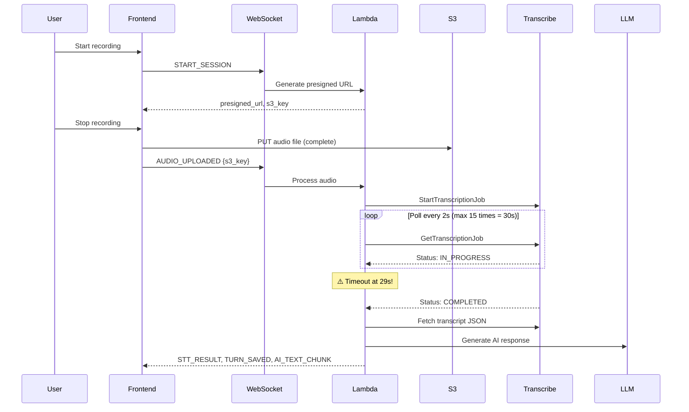
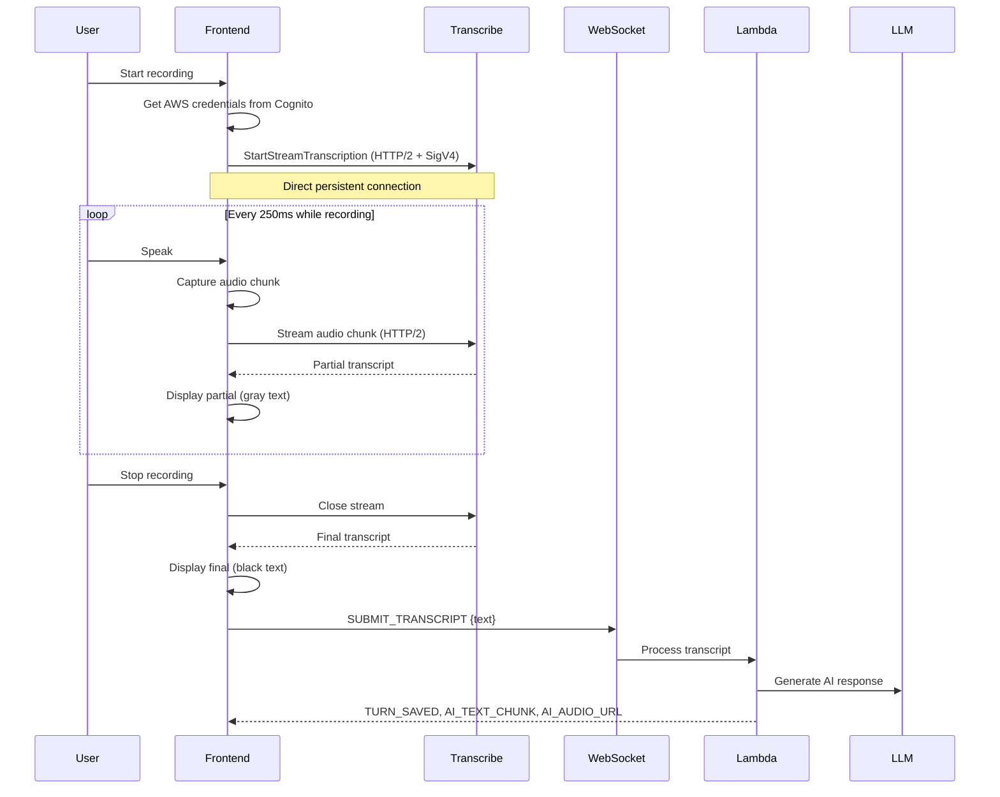

# Design Document: Streaming Transcription

## Overview

This design migrates the speaking practice pipeline from batch Amazon Transcribe (with 30-second polling timeouts) to **client-side streaming** Amazon Transcribe for real-time audio transcription. The current implementation uploads complete audio files to S3, then polls batch Transcribe jobs which timeout while Lambda has a 29-second limit.

**CRITICAL ARCHITECTURAL FINDING**: After thorough AWS documentation research, Lambda WebSocket handlers **CANNOT** maintain persistent Transcribe streams because:
1. Each WebSocket message triggers a **separate Lambda invocation** (stateless)
2. Transcribe Streaming requires a **persistent bidirectional connection**
3. Lambda execution contexts are not shared across WebSocket messages

**Solution**: Frontend connects **directly** to Amazon Transcribe Streaming API, bypassing Lambda for the streaming phase. Lambda only processes the final transcript after recording completes.

### Key Benefits

- **Real-time feedback**: Users see transcription as they speak (like Google Meet captions)
- **No polling timeouts**: Streaming eliminates the batch job polling pattern
- **No Lambda streaming complexity**: Client handles streaming directly
- **Better UX**: Partial transcripts provide immediate visual feedback
- **Simpler architecture**: No need for persistent connections in Lambda

### Constraints

- Frontend must implement AWS Signature Version 4 authentication for Transcribe API
- Audio format must be PCM or Opus (16kHz, mono)
- Transcribe Streaming has 4-hour maximum duration limit
- Requires CORS configuration for direct browser-to-Transcribe communication

## Architecture

### Current Architecture (Batch Transcribe)



**Problems:**
- Polling loop can timeout (30s max, Lambda 29s limit)
- No feedback until recording completes
- S3 upload adds latency
- Batch job overhead (job creation, polling, cleanup)


### New Architecture (Client-Side Streaming)

**CRITICAL**: Lambda WebSocket handlers are **stateless** - each message is a separate invocation. They **CANNOT** maintain persistent Transcribe streams.

**AWS Documentation Sources:**
- [Lambda execution environment lifecycle](https://docs.aws.amazon.com/lambda/latest/dg/lambda-runtime-environment.html): "Each phase starts with an event... Lambda freezes the execution environment when the runtime and each extension have completed"
- [API Gateway WebSocket overview](https://docs.aws.amazon.com/apigateway/latest/developerguide/apigateway-websocket-api-overview.html): Each WebSocket message triggers a separate Lambda invocation
- [Transcribe Streaming docs](https://docs.aws.amazon.com/transcribe/latest/dg/streaming.html): "Streaming content is delivered as a series of sequential data packets... Amazon Transcribe transcribes instantaneously"



**Key Architectural Changes:**
1. **Frontend → Transcribe Direct**: Browser connects directly to Transcribe Streaming API using HTTP/2
2. **No Lambda in streaming path**: Lambda only processes final transcript
3. **AWS SigV4 in browser**: Frontend signs requests using temporary Cognito credentials
4. **Persistent connection**: Single HTTP/2 connection maintained by browser, not Lambda

**Why This Works:**
- Browser maintains persistent HTTP/2 connection (not Lambda)
- No Lambda timeout issues (streaming happens client-side)
- Transcribe Streaming designed for direct client connections
- AWS SDK for JavaScript supports Transcribe Streaming natively

## Components and Interfaces

### Frontend Components

#### 1. Audio Recorder (`use-audio-recorder.ts`)

**Current Implementation:**
```typescript
// Records complete audio, then uploads to S3
const recorder = new MediaRecorder(stream, { mimeType: "audio/webm;codecs=opus" });
recorder.ondataavailable = (ev) => chunks.push(ev.data);
recorder.onstop = async () => {
  const blob = new Blob(chunks, { type: "audio/webm" });
  await uploadToS3(presignedUrl, blob);
  onRecordingComplete(s3Key);
};
```

**New Implementation:**
```typescript
// Streams audio chunks directly to Transcribe
const recorder = new MediaRecorder(stream, {
  mimeType: "audio/webm;codecs=opus",
  audioBitsPerSecond: 16000
});

recorder.ondataavailable = (ev: BlobEvent) => {
  if (ev.data.size > 0) {
    // Send chunk directly to Transcribe (not WebSocket)
    transcribeClient.sendAudioChunk(ev.data);
  }
};

// Start with 250ms chunks
recorder.start(250);
```

**Changes:**
- Remove S3 upload logic entirely
- Send chunks to Transcribe client (not WebSocket)
- Configure 250ms chunk interval
- Ensure 16kHz sample rate, mono channel

#### 2. Transcribe Streaming Client (`use-transcribe-streaming.ts`)

**New Component** - Handles direct connection to Transcribe API:

```typescript
import { TranscribeStreamingClient, StartStreamTranscriptionCommand } from "@aws-sdk/client-transcribe-streaming";

class TranscribeStreamingService {
  private client: TranscribeStreamingClient;
  private stream: AsyncIterable<AudioEvent> | null = null;
  
  constructor(credentials: AwsCredentialIdentity, region: string) {
    this.client = new TranscribeStreamingClient({
      region,
      credentials
    });
  }
  
  async startStream(
    languageCode: string = "en-US",
    sampleRate: number = 16000,
    mediaEncoding: string = "ogg-opus"
  ): Promise<void> {
    const audioStream = this.createAudioStream();
    
    const command = new StartStreamTranscriptionCommand({
      LanguageCode: languageCode,
      MediaSampleRateHertz: sampleRate,
      MediaEncoding: mediaEncoding,
      AudioStream: audioStream
    });
    
    const response = await this.client.send(command);
    
    // Process transcript events
    for await (const event of response.TranscriptResultStream!) {
      if (event.TranscriptEvent) {
        const results = event.TranscriptEvent.Transcript?.Results || [];
        for (const result of results) {
          if (result.Alternatives && result.Alternatives.length > 0) {
            const transcript = result.Alternatives[0].Transcript;
            const isPartial = result.IsPartial;
            
            // Emit transcript event
            this.onTranscript({
              text: transcript || "",
              isPartial: isPartial || false,
              confidence: result.Alternatives[0].Items?.[0]?.Confidence || 1.0
            });
          }
        }
      }
    }
  }
  
  async sendAudioChunk(blob: Blob): Promise<void> {
    const arrayBuffer = await blob.arrayBuffer();
    const audioEvent = {
      AudioEvent: {
        AudioChunk: new Uint8Array(arrayBuffer)
      }
    };
    
    // Add to stream (implementation depends on SDK)
    this.audioStreamGenerator.push(audioEvent);
  }
  
  async closeStream(): Promise<void> {
    this.audioStreamGenerator.end();
  }
  
  private createAudioStream(): AsyncIterable<AudioEvent> {
    // Create async generator for audio chunks
    this.audioStreamGenerator = new AudioStreamGenerator();
    return this.audioStreamGenerator.stream();
  }
  
  onTranscript: (transcript: TranscriptResult) => void = () => {};
}
```

**Key Implementation Details:**
1. **AWS SDK for JavaScript**: Use `@aws-sdk/client-transcribe-streaming` (v3)
2. **Credentials**: Get from Cognito Identity Pool (temporary credentials)
3. **HTTP/2 Connection**: SDK handles persistent connection automatically
4. **Async Iteration**: Process transcript events as they arrive

#### 3. Transcript Display Component

**UI States:**
```typescript
interface TranscriptState {
  finalText: string;      // Black text (confirmed)
  partialText: string;    // Gray text (in-progress)
  isStreaming: boolean;
}

// Display logic
<div className="transcript">
  <span className="final">{finalText}</span>
  {isStreaming && <span className="partial text-gray-500">{partialText}</span>}
</div>
```

### Backend Components

#### 1. WebSocket Handler (`websocket_handler.py`)

**Simplified Actions** - No streaming logic needed:

```python
def submit_transcript(self, session_id: str, connection_id: str, body: dict[str, Any]) -> dict[str, Any]:
    """Process final transcript from client-side streaming."""
    session = self._get_session(session_id)
    if not session:
        return _response(404, {"message": "Session không tồn tại."})
    
    text = str(body.get("text") or "").strip()
    confidence = float(body.get("confidence") or 0.0)
    
    if not text or confidence < 0.5:
        self.send_message({"event": "STT_LOW_CONFIDENCE", "confidence": confidence})
        return _response(200, {"message": "Low confidence"})
    
    self._sync_connection(session, connection_id)
    
    # Continue with existing LLM pipeline
    result = self.submit_turn_use_case.execute(
        SubmitSpeakingTurnCommand(
            user_id=session.user_id,
            session_id=session_id,
            text=text,
            is_hint_used=False,
            audio_url=None  # No S3 URL for streaming
        )
    )
    
    if not result.is_success or result.value is None:
        self.send_message({"event": "ERROR", "message": result.error or "Lỗi xử lý lượt nói."})
        return _response(422, {"message": result.error})
    
    response = result.value
    self.send_message({"event": "TURN_SAVED", "turn_index": response.user_turn.turn_index})
    self.send_message({"event": "AI_TEXT_CHUNK", "chunk": response.ai_turn.content, "done": True})
    if response.ai_turn.audio_url:
        self.send_message({
            "event": "AI_AUDIO_URL",
            "url": response.ai_turn.audio_url,
            "text": response.ai_turn.content
        })
    
    return _response(200, {"message": "Transcript processed"})
```

**Route Mapping:**
```python
def handler(event, context):
    # ... existing code ...
    
    if action == "SUBMIT_TRANSCRIPT":
        return controller.submit_transcript(str(session_id), connection_id, body)
    
    # Keep existing actions for backward compatibility during migration
    if action == "START_SESSION":
        return controller.start_session(str(session_id), connection_id)
    if action == "AUDIO_UPLOADED":
        return controller.audio_uploaded(str(session_id), connection_id, body)
```

**Removed Components:**
- ~~StreamingSTTService~~ (not needed - client handles streaming)
- ~~start_streaming() handler~~ (not needed)
- ~~audio_chunk() handler~~ (not needed)
- ~~end_streaming() handler~~ (replaced by submit_transcript)

#### 2. IAM Policy for Cognito Identity Pool

**New IAM Policy** - Allow authenticated users to call Transcribe Streaming:

```yaml
TranscribeStreamingPolicy:
  Type: AWS::IAM::Policy
  Properties:
    PolicyName: TranscribeStreamingAccess
    PolicyDocument:
      Version: '2012-10-17'
      Statement:
        - Effect: Allow
          Action:
            - transcribe:StartStreamTranscription
          Resource: '*'
    Roles:
      - !Ref CognitoAuthenticatedRole
```

**Cognito Identity Pool Configuration:**
```yaml
IdentityPool:
  Type: AWS::Cognito::IdentityPool
  Properties:
    AllowUnauthenticatedIdentities: false
    CognitoIdentityProviders:
      - ClientId: !Ref UserPoolClient
        ProviderName: !GetAtt UserPool.ProviderName

AuthenticatedRole:
  Type: AWS::IAM::Role
  Properties:
    AssumeRolePolicyDocument:
      Version: '2012-10-17'
      Statement:
        - Effect: Allow
          Principal:
            Federated: cognito-identity.amazonaws.com
          Action: sts:AssumeRoleWithWebIdentity
          Condition:
            StringEquals:
              cognito-identity.amazonaws.com:aud: !Ref IdentityPool
            ForAnyValue:StringLike:
              cognito-identity.amazonaws.com:amr: authenticated
    ManagedPolicyArns:
      - !Ref TranscribeStreamingPolicy
```

## Data Models

### WebSocket Message Protocol

#### Client → Server

```typescript
// Submit final transcript (after client-side streaming completes)
{
  "action": "SUBMIT_TRANSCRIPT",
  "session_id": "01HXXX...",
  "text": "Hello how are you",
  "confidence": 0.92
}
```

#### Server → Client

```typescript
// Turn saved
{
  "event": "TURN_SAVED",
  "turn_index": 3
}

// AI response
{
  "event": "AI_TEXT_CHUNK",
  "chunk": "I'm doing well, thank you!",
  "done": true
}

// AI audio
{
  "event": "AI_AUDIO_URL",
  "url": "https://...",
  "text": "I'm doing well, thank you!"
}

// Low confidence
{
  "event": "STT_LOW_CONFIDENCE",
  "confidence": 0.42
}
```

### Transcribe Streaming Protocol (Client-Side)

**Frontend uses AWS SDK for JavaScript v3:**

```typescript
import { TranscribeStreamingClient, StartStreamTranscriptionCommand } from "@aws-sdk/client-transcribe-streaming";

// Initialize client with Cognito credentials
const client = new TranscribeStreamingClient({
  region: "ap-southeast-1",
  credentials: fromCognitoIdentityPool({
    client: new CognitoIdentityClient({ region: "ap-southeast-1" }),
    identityPoolId: "ap-southeast-1:xxxxx",
    logins: {
      [`cognito-idp.ap-southeast-1.amazonaws.com/${userPoolId}`]: idToken
    }
  })
});

// Start streaming
const command = new StartStreamTranscriptionCommand({
  LanguageCode: "en-US",
  MediaSampleRateHertz: 16000,
  MediaEncoding: "ogg-opus",
  AudioStream: audioStreamGenerator()
});

const response = await client.send(command);

// Process transcripts
for await (const event of response.TranscriptResultStream!) {
  // Handle partial and final transcripts
}
```

## Audio Format Specifications

### Requirements (from AWS Transcribe)

- **Sample Rate**: 16,000 Hz (16 kHz) - optimal for speech
- **Channels**: 1 (mono)
- **Encoding**: PCM (signed 16-bit little-endian) or Opus
- **Container**: Raw PCM or Ogg (for Opus)
- **Chunk Size**: 50-200ms recommended

### Frontend Configuration

```typescript
const stream = await navigator.mediaDevices.getUserMedia({
  audio: {
    sampleRate: 16000,        // 16 kHz
    channelCount: 1,          // Mono
    echoCancellation: true,   // Improve quality
    noiseSuppression: true    // Reduce background noise
  }
});

const mimeType = "audio/webm;codecs=opus";  // Opus in WebM container
const recorder = new MediaRecorder(stream, {
  mimeType: mimeType,
  audioBitsPerSecond: 16000
});

// 250ms chunks
recorder.start(250);
```

### Chunk Size Calculation

```
chunk_size_in_bytes = chunk_duration_ms / 1000 * sample_rate * bytes_per_sample
                    = 250 / 1000 * 16000 * 2
                    = 8000 bytes per chunk
```

For 250ms chunks at 16kHz PCM:
- **8 KB per chunk**
- **4 chunks per second**
- **~32 KB/s bandwidth**

## Error Handling

### Error Scenarios

| Error | Cause | Frontend Action | Backend Action |
|-------|-------|----------------|----------------|
| **Transcribe Connection Failed** | Network issue, invalid credentials | Display "Connection failed. Please try again." | N/A (client-side) |
| **Transcribe Stream Error** | API error (rate limit, invalid audio) | Display error message, allow retry | N/A (client-side) |
| **Low Confidence** | Poor audio quality or unclear speech | Display "Could not understand. Please try again." | Reject transcript with confidence < 0.5 |
| **Permission Denied** | Microphone access denied | Display "Microphone access required" | N/A (client-side) |
| **Credentials Expired** | Cognito token expired | Refresh credentials automatically | N/A (client-side) |

### Implementation

```typescript
class TranscribeStreamingService {
  async startStream(): Promise<void> {
    try {
      const command = new StartStreamTranscriptionCommand({...});
      const response = await this.client.send(command);
      
      for await (const event of response.TranscriptResultStream!) {
        // Process transcripts
      }
    } catch (error) {
      if (error.name === "ThrottlingException") {
        this.onError("Rate limit exceeded. Please wait and try again.");
      } else if (error.name === "BadRequestException") {
        this.onError("Invalid audio format. Please check your microphone settings.");
      } else if (error.name === "UnrecognizedClientException") {
        // Refresh credentials and retry
        await this.refreshCredentials();
        await this.startStream();
      } else {
        this.onError("Transcription failed. Please try again.");
      }
    }
  }
  
  private async refreshCredentials(): Promise<void> {
    // Get new credentials from Cognito
    const credentials = await fromCognitoIdentityPool({...})();
    this.client = new TranscribeStreamingClient({
      region: this.region,
      credentials
    });
  }
}
```

## Testing Strategy

### Unit Tests

**Frontend:**
- Audio recorder captures chunks at 250ms intervals
- WebSocket sends AUDIO_CHUNK messages with correct format
- Transcript display updates on PARTIAL_TRANSCRIPT events
- Final transcript replaces partial text on FINAL_TRANSCRIPT

**Backend:**
- WebSocket handler routes START_STREAMING, AUDIO_CHUNK, END_STREAMING
- StreamingSTTService initializes Transcribe stream with correct parameters
- Audio chunks are forwarded to Transcribe stream
- Transcripts are buffered and retrieved correctly
- Stream cleanup on close/error

### Integration Tests

1. **End-to-End Streaming Flow**
   - Start recording → send chunks → stop recording
   - Verify partial transcripts arrive during recording
   - Verify final transcript triggers LLM pipeline
   - Verify AI response is generated and sent

2. **Error Scenarios**
   - WebSocket disconnect during streaming
   - Transcribe API error
   - Low confidence transcript
   - Timeout (no audio for 15s)

3. **Audio Format Validation**
   - 16kHz sample rate
   - Mono channel
   - Opus encoding
   - Chunk size 50-200ms

### Manual Testing Checklist

- [ ] Record 5-second audio, verify partial transcripts appear
- [ ] Record 30-second audio, verify no timeout
- [ ] Test with background noise
- [ ] Test with unclear speech (low confidence)
- [ ] Test WebSocket reconnection
- [ ] Test on mobile (iOS Safari, Android Chrome)
- [ ] Verify AI response after transcription
- [ ] Compare accuracy with batch transcription

## Migration Strategy

### Phase 1: Add Client-Side Streaming (Parallel Mode)

**Goal**: Deploy streaming without breaking existing batch flow

1. **Add Cognito Identity Pool** with Transcribe Streaming permissions
2. **Add frontend Transcribe client** with direct API connection
3. **Add SUBMIT_TRANSCRIPT WebSocket action** (replaces END_STREAMING)
4. **Keep existing actions** (START_SESSION, AUDIO_UPLOADED)
5. **Add feature flag** in frontend:
   ```typescript
   const USE_STREAMING = process.env.NEXT_PUBLIC_USE_STREAMING === "true";
   ```
6. **Deploy backend** with new SUBMIT_TRANSCRIPT handler
7. **Test streaming** with feature flag enabled

**Verification:**
- Existing users continue using batch flow
- Test users can enable streaming via flag
- Both flows work independently

### Phase 2: Gradual Rollout

**Goal**: Enable streaming for subset of users

1. **Enable streaming for 10% of users** (A/B test)
2. **Monitor metrics**:
   - Transcription latency (batch vs streaming)
   - Accuracy (WER - Word Error Rate)
   - Error rates
   - User satisfaction
3. **Increase to 50%** if metrics are positive
4. **Enable for 100%** after validation

**Rollback Plan:**
- If streaming has issues, disable feature flag
- Users fall back to batch flow automatically

### Phase 3: Remove Batch Code

**Goal**: Clean up deprecated batch implementation

1. **Remove batch Transcribe code** from `speaking_pipeline_services.py`
2. **Remove S3 upload** for transcription (keep for analytics if needed)
3. **Remove START_SESSION presigned URL** generation
4. **Remove AUDIO_UPLOADED** WebSocket action
5. **Remove Lambda Transcribe permissions** (batch only)

**Verification:**
- All users on streaming
- No batch Transcribe API calls
- Reduced Lambda execution time
- Reduced S3 storage costs

### Backward Compatibility During Migration

**Keep these during Phase 1-2:**
- `START_SESSION` action (generates presigned URL)
- `AUDIO_UPLOADED` action (batch transcription)
- `TranscribeSTTService` class (batch implementation)
- Lambda IAM permissions for batch Transcribe

**Remove in Phase 3:**
- All batch-related code
- Batch IAM permissions from Lambda
- S3 upload logic for transcription

## IAM Permissions Update

### Current Permissions (Batch)

```yaml
# Lambda function permissions
Policies:
  - Statement:
      - Effect: Allow
        Action:
          - transcribe:StartTranscriptionJob
          - transcribe:GetTranscriptionJob
          - transcribe:DeleteTranscriptionJob
        Resource: "*"
```

### New Permissions (Client-Side Streaming)

**Lambda does NOT need Transcribe permissions** - streaming happens client-side.

**Cognito Authenticated Role needs Transcribe Streaming permission:**

```yaml
# New: Cognito Identity Pool
IdentityPool:
  Type: AWS::Cognito::IdentityPool
  Properties:
    IdentityPoolName: LexiIdentityPool
    AllowUnauthenticatedIdentities: false
    CognitoIdentityProviders:
      - ClientId: !Ref UserPoolClient
        ProviderName: !GetAtt UserPool.ProviderName

# New: Authenticated Role for Cognito users
CognitoAuthenticatedRole:
  Type: AWS::IAM::Role
  Properties:
    AssumeRolePolicyDocument:
      Version: '2012-10-17'
      Statement:
        - Effect: Allow
          Principal:
            Federated: cognito-identity.amazonaws.com
          Action: sts:AssumeRoleWithWebIdentity
          Condition:
            StringEquals:
              cognito-identity.amazonaws.com:aud: !Ref IdentityPool
            ForAnyValue:StringLike:
              cognito-identity.amazonaws.com:amr: authenticated
    Policies:
      - PolicyName: TranscribeStreamingAccess
        PolicyDocument:
          Version: '2012-10-17'
          Statement:
            - Effect: Allow
              Action:
                - transcribe:StartStreamTranscription
              Resource: '*'

# Attach role to identity pool
IdentityPoolRoleAttachment:
  Type: AWS::Cognito::IdentityPoolRoleAttachment
  Properties:
    IdentityPoolId: !Ref IdentityPool
    Roles:
      authenticated: !GetAtt CognitoAuthenticatedRole.Arn
```

### Migration Permissions (Both)

During Phase 1-2, keep both:

```yaml
# Lambda (for batch transcription - backward compatibility)
Policies:
  - Statement:
      - Effect: Allow
        Action:
          - transcribe:StartTranscriptionJob
          - transcribe:GetTranscriptionJob
          - transcribe:DeleteTranscriptionJob
        Resource: "*"

# Cognito (for client-side streaming)
CognitoAuthenticatedRole:
  Policies:
    - PolicyName: TranscribeStreamingAccess
      PolicyDocument:
        Statement:
          - Effect: Allow
            Action:
              - transcribe:StartStreamTranscription
            Resource: '*'
```

### Final Permissions (Phase 3)

```yaml
# Lambda: NO Transcribe permissions needed
# (Remove all transcribe:* permissions from Lambda)

# Cognito: Only streaming permission
CognitoAuthenticatedRole:
  Policies:
    - PolicyName: TranscribeStreamingAccess
      PolicyDocument:
        Statement:
          - Effect: Allow
            Action:
              - transcribe:StartStreamTranscription
            Resource: '*'
```

## Dependencies

### New Frontend Packages

Add to `package.json`:

```json
{
  "dependencies": {
    "@aws-sdk/client-transcribe-streaming": "^3.x",
    "@aws-sdk/client-cognito-identity": "^3.x",
    "@aws-sdk/credential-providers": "^3.x"
  }
}
```

**Why these packages?**
- `@aws-sdk/client-transcribe-streaming`: Official AWS SDK for Transcribe Streaming (supports HTTP/2)
- `@aws-sdk/client-cognito-identity`: Get temporary credentials from Cognito Identity Pool
- `@aws-sdk/credential-providers`: Helper to create credentials from Cognito tokens

### Backend Dependencies

**NO NEW BACKEND DEPENDENCIES** - Streaming logic moved to frontend.

Remove from `requirements.txt` (if added):
```
# NOT NEEDED - streaming is client-side
# amazon-transcribe-streaming-sdk==0.6.2
```

### Infrastructure Dependencies

**New CloudFormation Resources:**
- Cognito Identity Pool
- IAM Role for authenticated Cognito users
- IAM Policy for Transcribe Streaming access

## Performance Considerations

### Latency Comparison

| Metric | Batch (Current) | Streaming (New) |
|--------|----------------|-----------------|
| **Time to first transcript** | 5-10s (after upload) | 500ms-1s (partial) |
| **Total transcription time** | 10-30s | 2-5s |
| **User feedback delay** | After recording ends | Real-time |
| **Timeout risk** | High (30s polling) | Low (no polling) |

### Bandwidth Usage

**Batch:**
- Upload complete file: ~500 KB for 30s audio
- Single upload burst

**Streaming:**
- 4 chunks/second × 8 KB = 32 KB/s
- Total for 30s: ~960 KB (slightly higher due to overhead)
- Distributed over time (smoother)

### Lambda Execution Time

**Batch:**
- Execution time: 10-30s (polling)
- Risk of timeout at 29s

**Streaming:**
- Execution time: Recording duration + 1-2s
- No timeout risk (completes when user stops)

## Monitoring and Observability

### CloudWatch Metrics

```python
import boto3
cloudwatch = boto3.client('cloudwatch')

# Track streaming metrics
cloudwatch.put_metric_data(
    Namespace='Lexi/Transcription',
    MetricData=[
        {
            'MetricName': 'StreamingLatency',
            'Value': latency_ms,
            'Unit': 'Milliseconds'
        },
        {
            'MetricName': 'TranscriptConfidence',
            'Value': confidence,
            'Unit': 'None'
        },
        {
            'MetricName': 'StreamErrors',
            'Value': 1 if error else 0,
            'Unit': 'Count'
        }
    ]
)
```

### Logging

```python
logger.info(
    "Streaming transcription completed",
    extra={
        "session_id": session_id,
        "duration_seconds": duration,
        "chunk_count": chunk_count,
        "final_confidence": confidence,
        "transcript_length": len(transcript)
    }
)
```

### Alerts

- **High error rate**: > 5% streaming errors
- **Low confidence**: > 20% transcripts with confidence < 0.5
- **Timeout rate**: > 2% streams timing out

## Security Considerations

### AWS Credentials Management

**Cognito Identity Pool with Temporary Credentials:**
- Frontend gets temporary AWS credentials from Cognito Identity Pool
- Credentials are scoped to authenticated users only
- Credentials expire after 1 hour (configurable)
- Credentials are automatically refreshed by AWS SDK

**Implementation:**
```typescript
import { fromCognitoIdentityPool } from "@aws-sdk/credential-providers";
import { CognitoIdentityClient } from "@aws-sdk/client-cognito-identity";

const credentials = fromCognitoIdentityPool({
  client: new CognitoIdentityClient({ region: "ap-southeast-1" }),
  identityPoolId: process.env.NEXT_PUBLIC_IDENTITY_POOL_ID!,
  logins: {
    [`cognito-idp.ap-southeast-1.amazonaws.com/${userPoolId}`]: idToken
  }
});

const transcribeClient = new TranscribeStreamingClient({
  region: "ap-southeast-1",
  credentials
});
```

### IAM Least Privilege

- Cognito authenticated role has ONLY `transcribe:StartStreamTranscription` permission
- No access to other AWS services
- No access to other users' data
- Scoped to specific region

### Audio Data

- Audio chunks sent directly to Transcribe (encrypted in transit via HTTPS)
- No S3 storage for transcription (reduced attack surface)
- Optional: Save to S3 after transcription for analytics (encrypted at rest)

### CORS Configuration

**Transcribe Streaming API requires CORS** - handled automatically by AWS SDK:
- SDK adds required headers (Origin, Authorization)
- Transcribe API validates origin
- No additional CORS configuration needed

## Open Questions

1. **Should we save audio to S3 after streaming?**
   - Pro: Analytics, debugging, compliance
   - Con: Storage costs, privacy concerns
   - **Recommendation**: Make it optional, default off

2. **How to handle very long recordings (> 4 hours)?**
   - Transcribe Streaming limit: 4 hours
   - **Recommendation**: Add frontend warning at 3:50, auto-stop at 4:00

3. **Should we support language auto-detection?**
   - Transcribe Streaming supports `IdentifyLanguage`
   - **Recommendation**: Phase 2 feature, start with en-US only

4. **Retry strategy for transient errors?**
   - **Recommendation**: Auto-retry once with exponential backoff, then show error to user

5. **Should we implement fallback to batch transcription?**
   - If client-side streaming fails, fall back to batch?
   - **Recommendation**: No - adds complexity. Show error and let user retry.

6. **How to handle Cognito credential refresh?**
   - Credentials expire after 1 hour
   - **Recommendation**: AWS SDK handles refresh automatically. Monitor for refresh failures.

## Alternative Architectures Considered

### Option 1: Client-Side Streaming (CHOSEN)

**Pros:**
- Simple architecture (no Lambda streaming complexity)
- No Lambda timeout issues
- Direct connection to Transcribe (lowest latency)
- AWS SDK handles connection management

**Cons:**
- Exposes AWS credentials to browser (mitigated by Cognito temporary credentials)
- Cannot process audio server-side before transcription
- Requires Cognito Identity Pool setup

### Option 2: Lambda WebSocket Streaming (REJECTED)

**Why Rejected:**
- Lambda WebSocket handlers are **stateless** - each message is a separate invocation
- Cannot maintain persistent Transcribe stream across invocations
- Would require complex state management (DynamoDB, Redis)
- Architecturally impossible without workarounds

**AWS Documentation Evidence:**
- [Lambda execution environment](https://docs.aws.amazon.com/lambda/latest/dg/lambda-runtime-environment.html): Execution environments are frozen between invocations
- [API Gateway WebSocket](https://docs.aws.amazon.com/apigateway/latest/developerguide/apigateway-websocket-api-overview.html): Each message triggers separate Lambda invocation

### Option 3: ECS Fargate Long-Running Service (REJECTED FOR MVP)

**Pros:**
- Can maintain persistent connections
- Full control over streaming logic
- Can process audio server-side

**Cons:**
- Much more complex (container deployment, orchestration)
- Higher cost (always-running service)
- Overkill for MVP
- Longer development time

**Recommendation**: Consider for Phase 2 if server-side processing is needed

## Success Criteria

### Functional

- [ ] Users see partial transcripts while speaking
- [ ] Final transcript triggers AI response
- [ ] No polling timeouts
- [ ] Error messages are clear and actionable

### Performance

- [ ] Time to first transcript < 1 second
- [ ] Total transcription time < 5 seconds (for 30s audio)
- [ ] < 2% error rate
- [ ] > 90% user satisfaction

### Technical

- [ ] No batch Transcribe API calls
- [ ] Lambda execution time reduced by 50%
- [ ] Code is maintainable and well-tested
- [ ] Migration completed without downtime

## References

- [AWS Transcribe Streaming Documentation](https://docs.aws.amazon.com/transcribe/latest/dg/streaming.html)
- [StartStreamTranscription API Reference](https://docs.aws.amazon.com/transcribe/latest/APIReference/API_streaming_StartStreamTranscription.html)
- [AWS SDK for JavaScript v3 - Transcribe Streaming](https://docs.aws.amazon.com/AWSJavaScriptSDK/v3/latest/client/transcribe-streaming/)
- [Cognito Identity Pools Documentation](https://docs.aws.amazon.com/cognito/latest/developerguide/identity-pools.html)
- [Lambda Execution Environment Lifecycle](https://docs.aws.amazon.com/lambda/latest/dg/lambda-runtime-environment.html)
- [API Gateway WebSocket APIs](https://docs.aws.amazon.com/apigateway/latest/developerguide/apigateway-websocket-api-overview.html)
- [MediaRecorder API (MDN)](https://developer.mozilla.org/en-US/docs/Web/API/MediaRecorder)

## Key Architectural Decision

**Decision**: Use client-side streaming with direct Transcribe API connection

**Rationale**:
1. **Lambda WebSocket handlers are stateless** - Each WebSocket message (START_STREAMING, AUDIO_CHUNK, END_STREAMING) triggers a **separate Lambda invocation**
2. **Cannot maintain persistent streams** - Transcribe Streaming requires a persistent bidirectional connection that cannot be maintained across Lambda invocations
3. **AWS Documentation confirms** - Lambda execution environments are frozen between invocations, making persistent connections impossible
4. **Client-side streaming is simpler** - Browser maintains persistent HTTP/2 connection, no Lambda complexity
5. **AWS SDK supports it** - `@aws-sdk/client-transcribe-streaming` is designed for browser use with Cognito credentials

**Trade-offs Accepted**:
- Exposes AWS credentials to browser (mitigated by Cognito temporary credentials with limited scope)
- Cannot process audio server-side before transcription (not needed for MVP)
- Requires Cognito Identity Pool setup (one-time infrastructure change)

**Alternatives Rejected**:
- Lambda WebSocket streaming: Architecturally impossible without complex workarounds
- ECS Fargate service: Overkill for MVP, much higher complexity and cost
